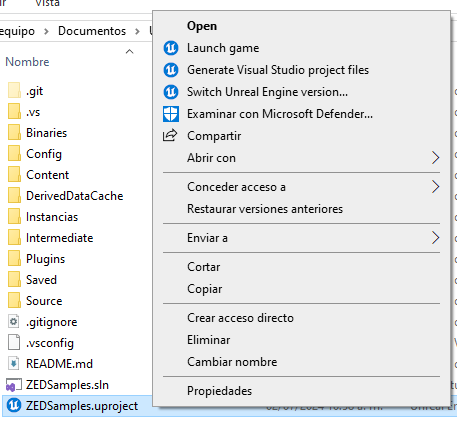
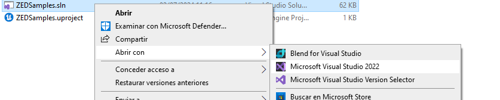
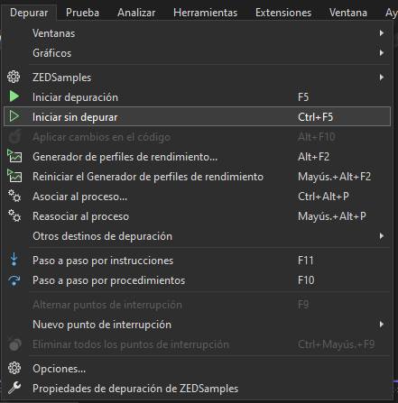

# ZED_UnrealEngine

Repositorio para poder trabajar con ZED utilizando el motor Unreal Engine.

##  Información técnica.

> - **CUDA** versión 12.1.0.
> - **ZED SDK** versión 4.1.2.
> - **Unreal Engine** versión 5.3.2.

##  Instalación

Para poder utilizar el plugin ZED en Unreal Engine es necesario realizar algunos pasos, es importante mencionar que parte de la información se encuentra en la [documentación de ZED](https://www.stereolabs.com/docs/ue5).

1. Se va a omitir la instalación de **Visual Studio** y **Unreal Engine**.

2. Es necesario descargar desde Github el [plugin de ZED con ejemplos para Unreal Engine 5](https://github.com/stereolabs/zed-UE5).

3. Si nuestra carpeta tiene la carpeta *Intermadiate* y el archivo *ZEDSamples.sln* entonces hay que eliminarlos.

4. Ya descomprimido nuestro proyecto podemos seleccionar ***ZEDSample.uproject*** con click derecho y darle click a la opción *Generate Visual Studio project files*
.
Esto generara las carpetas que eliminamos previamente.

5. Ahora, con click derecho seleccionamos el archivo *ZEDSamples.sln* abriendolo con **Visual Studio**.
.

6. Seleccionamos en *Depurar > Iniciar sin depurar* y esperamos a que el proyecto se compile.
.
> **NOTA**
> Puede ocurrir que nos mande un error relacionado a no encontrar el SDK CUDA, la solución es instalar CUDA una vez más.